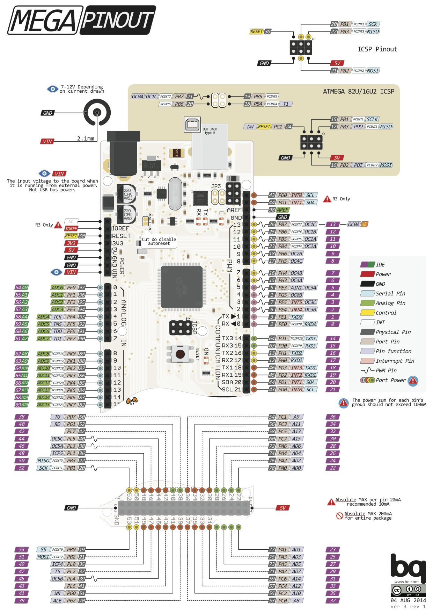

<p align="center"></p>
<br>
<h1 align="center">Arduino Advanced Guide</h1> 


<h4 align="right">Aug 22</h4>


# Tipos de datos en Arduino
## Directivas de precompilador
Se ejecutan antes de compilar el código y no se ejecutan en tiempo de ejecución como el resto de código. Nos permite incluir ficheros, definir constantes y aplicar condicionales.

    #include.
Con esta directiva podemos incluir ficheros externos a nuestro proyecto<br>
**#include <fichero.h>** Busca en los directorios de librerías por defecto<br>
**#include “C:\librerias\fichero.h”** Una ruta completa al archivo

    # define. 
Esta directiva permite definir un alias a un texto y su uso más extendido es la declaración de constantes. La principal utilidad es que se puede reutilizar en cualquier parte del código afectando a todas las referencias que se hagan a partir de entonces. La norma aconseja poner todos los define en mayúsculas para identificarlos claramente.

## Compilación condicional
#if /#endif/#else/#elif/#ifdef.<br>
Nos permite incluir o quitar código dependiendo de una condición. Controla la compilación de partes de un archivo de código fuente.<br>
**#if**. Si se cumple<br>
**#elif**. Si no se cumple<br>
**#ifdef**. Si esta definida = #if defined<br>
**#ifndef**. Si no esta definido<br>
**#undef**. anular la definición de una etiqueta.<br>
**#endif**. Termina el alcance de #if , #ifdef , #ifndef , #else , or **#elif**<br>

## Definición de variables
tipo nombre = valor; //  primero el tipo, luego un nombre descriptivo y por último podemos asignar un valor inicial<br>
```
uint8_t. 0 to 255
uint16_t. 0 to 65,535
int8_t. -128 to 127
```

## Otros tipos de datos
**boolean**: solo toma valores true o false. Ocupan un byte entero.<br>
**void**: solo se utiliza en los valores de retorno de las funciones para indicar que esa función no devuelve valor.<br>
**enum**: variables para almacenar estados predefinidos. Un ejemplo claro sería los estados de un sensor.<br>

# PROGMEM 
Almacena datos en la memoria flash (memoria de programa) en lugar de la  SRAM. Le dice al compilador "poner esta información en la memoria flash", en lugar de en la SRAM, donde normalmente iría. La palabra clave PROGMEM es un nodificador de variable, debe ser usada solo con los tipos de datos definidos en la biblioteca pgmspace.h.<br>
Biblioteca:
```
#include <avr/pgmspace.h>
```
### Sintaxis
const dataType variableName[ ] PROGMEM = {data0, data1, data3...};
- dataType - cualquier tipo de variable
- variableName - el nombre de nuesto dato o matriz

# Estructura de las librerías de Arduino

Lo importante, tienes dos archivos obligatorios, uno con la **extensión .h** (cabecera) y otro con la extensión .cpp (implementación del código). **La extensión .cpp** (que significa C++ del inglés C plus plus) que contiene todo el código fuente es decir, las definiciones de las funciones, la lógica. El otro archivo tiene extensión .h (viene del inglés header y significa cabecera). Es como si fuera un listado de las funciones que hay dentro del código fuente, en el archivo .cpp. Le dice a nuestro programa qué funciones va a utilizar de la librería.

**Archivo keywords.txt** suele estar en todas las librerías es keywords.txt (keywords en español es palabras clave). Es un archivo de texto que contiene las palabras claves de la librería de Arduino. Su utilidad es indicar al IDE de Arduino que coloree dichas palabras cuando se escriban en el editor.

> :warning: **Warning:** Hay que reiniciar el IDE de Arduino para que aparezca librería instaladas manualmente..!!!

<br>

## Using Exit (0) Statement Stop void loop () function
The void loop can also be stopped using exit() statement. This statement is one of the simplest ways to stop a void loop function. Remember to use this statement at the end of your code because any instruction written after this line will not be executed until Arduino is reset or code is reuploaded.


## break; 
break is used to exit from a for, while or do…​while loop, bypassing the normal loop condition. It is also used to exit from a switch case statement.

<br>

# Pinout Arduino

<p align="center"></p>
<p align="center"></p>
<p align="center"></p>

<br>


---
Copyright &copy; 2022 [carjavi](https://github.com/carjavi). <br>
```www.instintodigital.net``` <br>
carjavi@hotmail.com <br>
<p align="center">
    <a href="https://instintodigital.net/" target="_blank"></a>
</p>


